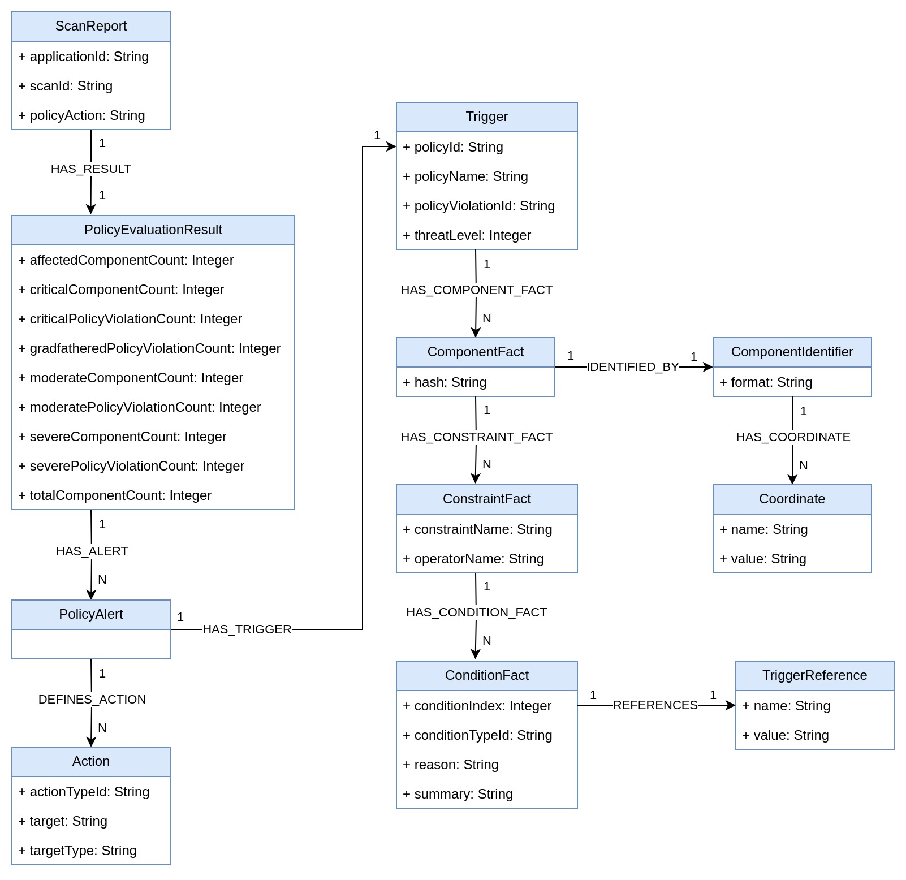

= jQAssistant Nexus IQ Plugin

This is the NexusIQ Plugin for https://jqassistant.org[jQAssistant].
It provides a scanner for report files that are exported via the Nexus IQ REST API.

For more information on jQAssistant see https://jqassistant.org[^].

== Usage

Add the plugin to the plugins section of the `jqassistant.yml` configuration file:

[source,yaml]
----
jqassistant:
  plugins:
    # Includes the jQAssistant NexusIQ plugin
    - group-id: org.jqassistant.plugin
      artifact-id: jqassistant-nexusiq-plugin
      version: 1.0.0-SNAPSHOT
  scan:
    include:
      files:
        # Add the to-be-scanned report file to this list
        - nexusiq:scan-report::path-to-nexusiq-report/report.json
  analyze:
    groups:
      - nexusiq:Default
----

To obtain the report JSON file from NexusIQ you can use the `evaluate` Maven goal from the https://help.sonatype.com/iqserver/integrations/sonatype-clm-for-maven#SonatypeCLMforMaven-EvaluatingEvaluatingProjectComponentswithSonatypeLifecycle[Sonatype CLM plugin].
Alternatively you can also use the https://help.sonatype.com/iqserver/integrations/nexus-iq-cli#NexusIQCLI-ResultsEvaluationresults[NexusIQ CLI].

== Model

== Use Cases

This plugin includes rules to expose warnings and failures from the Nexus IQ report as minor and major jQA violations.

The constraints are provided via the group `nexusiq:Default`:

- `nexusiq:Warning` indicates violations with level "warn" that are reported by Nexus IQ
- `nexusiq:Failure` indicates violations with level "fail" that are reported by Nexus IQ

== Supported Versions

Tested with Nexus IQ release 1.165.

== Changelog

=== 1.0.0

- Initial Release
